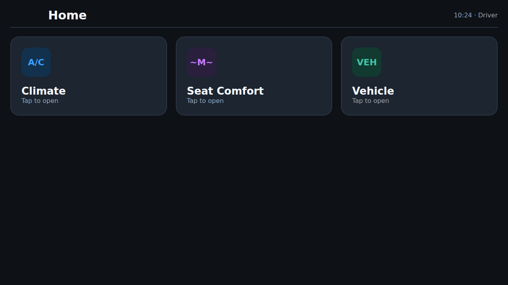
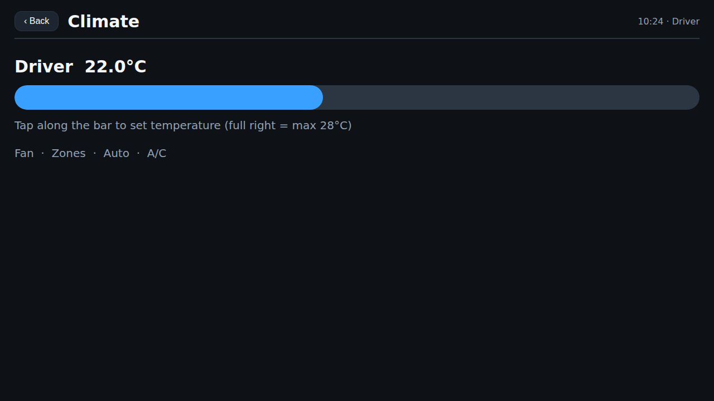
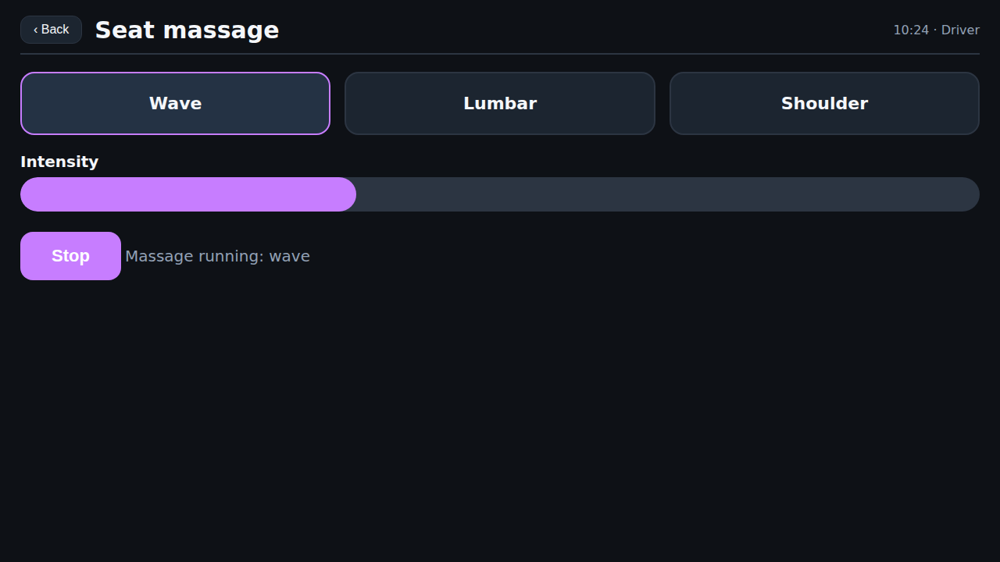
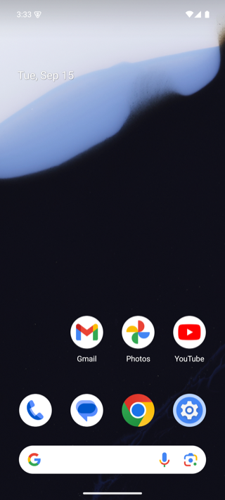
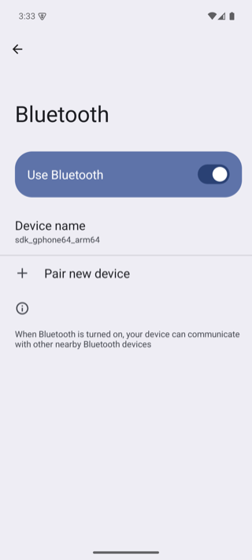

# IVI Visual Agent

A fully local, goal-driven visual agent for standard Android phones, Android Automotive,
and Android IVI testing.
Give it an outcome such as `Open the Bluetooth settings screen`; it observes the current
screen, chooses one grounded action, executes it through ADB, and independently verifies
the result.

The agent does not contain a recorded menu route for the emulator, a Samsung phone, or
the target IVI. It uses Android accessibility data when available and a numbered visual
grid when a custom IVI surface exposes only pixels.

> This is an early bench-testing MVP. Do not operate it in a moving vehicle or connect it
> to a production vehicle without an appropriate safety review.

## Highlights

- 🚗 **Custom OEM IVI, driven end to end — fully local.** On a brand-styled IVI
  (custom Home / Climate / Vehicle-settings / Seat-massage screens, proprietary
  icons, no accessibility tree), local **`qwen3-vl:8b`** completes both
  **"Open the climate screen"** and **"Start the seat massage"**, guided only by a
  PDF-derived knowledge profile — **no fixed tap coordinates**. Ships as a runnable
  demo (native WebView app + manual scaffold) you can reproduce without a vehicle.

  | Home | Climate | Seat massage (running) |
  | --- | --- | --- |
  |  |  |  |

  See [Custom OEM IVI (Benz-style) bench bring-up](#custom-oem-ivi-benz-style-bench-bring-up).

- 📊 **AndroidWorld: 4 / 6 (67%) on the built-in-app subset, fully offline.** A
  small *local* model on Google's [AndroidWorld](https://github.com/google-research/android_world)
  benchmark — for reference, published *cloud* VLM agents (GPT-4o / Gemini class)
  report roughly **50–60% on the full 116-task suite**. See
  [AndroidWorld benchmark](#androidworld-benchmark) for the per-task table and
  honest caveats.

- 🧠 **Manual-driven, no training.** A local multimodal RAG profile (semantic text
  embeddings + optional CLIP icon matching) turns an owner's manual into the
  recognition reference for proprietary controls — see
  [Semantic retrieval](#semantic-retrieval-optional).

## Tested emulator screens

These are direct screenshots from the Android 15 Automotive ARM64 emulator used during
development.

### Automotive Home


### Bluetooth settings — passed

```bash
ivi-agent --config config.json run --serial emulator-5554 \
  --goal "Open the Bluetooth settings screen"
```


### Display settings — passed

```bash
ivi-agent --config config.json run --serial emulator-5554 \
  --goal "Open the Display settings screen"
```


### Sound settings — passed

```bash
ivi-agent --config config.json run --serial emulator-5554 \
  --goal "Open the Sound settings screen"
```


The three runs above passed with the local `qwen3.5:4b` vision model. The final screen
was verified from visible titles and page controls, not from the action planner's claim.

### Standard Android phone — passed

The same agent was also tested on a separate Android 15 Pixel 7 ARM64 emulator. The
clean-state run started at the normal phone Home screen:



```bash
adb -s emulator-5556 shell am force-stop com.android.settings
adb -s emulator-5556 shell input keyevent HOME

ivi-agent --config config.json run --serial emulator-5556 \
  --goal "Open the Bluetooth settings screen"
```

It passed in four actions by visually navigating Settings, Connected devices,
Connection preferences, and Bluetooth. The final title was independently recognized
as the active destination rather than confusing the earlier Bluetooth menu row for
completion.



## Complete macOS setup

The commands below are the Apple Silicon setup used for the screenshots above.

### 1. Install the local tools

```bash
brew install android-commandlinetools openjdk scrcpy tesseract ollama poppler

export ANDROID_HOME="/opt/homebrew/share/android-commandlinetools"
export JAVA_HOME="/opt/homebrew/opt/openjdk/libexec/openjdk.jdk/Contents/Home"
export PATH="$JAVA_HOME/bin:$ANDROID_HOME/cmdline-tools/latest/bin:$ANDROID_HOME/platform-tools:$ANDROID_HOME/emulator:$PATH"
```

To make those paths permanent, add the two `export` lines to `~/.zshrc`, then open a new
terminal or run `source ~/.zshrc`.

### 2. Install and create the Automotive emulator

```bash
yes | sdkmanager --licenses

sdkmanager \
  "platform-tools" \
  "emulator" \
  "system-images;android-35-ext15;android-automotive;arm64-v8a"

echo no | avdmanager create avd \
  --name ivi_agent_api35 \
  --package "system-images;android-35-ext15;android-automotive;arm64-v8a" \
  --device automotive_1080p_landscape \
  --force
```

Confirm that the AVD exists:

```bash
emulator -list-avds
```

Expected output includes:

```text
ivi_agent_api35
```

### 3. Start the emulator

For a visible simulator window:

```bash
emulator @ivi_agent_api35 -no-audio -no-boot-anim \
  -gpu swiftshader_indirect
```

For a headless CI-style run:

```bash
emulator @ivi_agent_api35 -no-window -no-audio -no-boot-anim \
  -no-snapshot -gpu swiftshader_indirect
```

In another terminal, wait for Android and confirm the serial:

```bash
adb -s emulator-5554 wait-for-device

until [ "$(adb -s emulator-5554 shell getprop sys.boot_completed | tr -d '\r')" = "1" ]; do
  sleep 2
done

adb devices
```

Expected output:

```text
List of devices attached
emulator-5554 device
```

If the serial is different, use the serial printed by `adb devices` in subsequent
commands.

### 4. Start Ollama and download the local vision model

Run this in a separate terminal and leave it running:

```bash
ollama serve
```

Then download the model once:

```bash
ollama pull qwen3.5:4b
ollama list
```

### 5. Clone and install the agent

```bash
git clone https://github.com/vanarasai/ivi-visual-agent.git
cd ivi-visual-agent

python3 -m venv .venv
source .venv/bin/activate
python -m pip install --upgrade pip
python -m pip install -e .

cp config.example.json config.json
ivi-agent --config config.json doctor
python -m unittest discover -s tests -v
```

### 6. Mirror or record the emulator

Open a live scrcpy window:

```bash
ivi-agent scrcpy --serial emulator-5554
```

Or record the complete trial:

```bash
ivi-agent scrcpy --serial emulator-5554 --record session.mp4
```

### 7. Perform a safe dry run

A dry run captures the real screen and proposes only the first action:

```bash
ivi-agent --config config.json run \
  --serial emulator-5554 \
  --goal "Open the Bluetooth settings screen" \
  --dry-run
```

Check the proposed target, confidence, screenshot, and report under `runs/`.

### 8. Run the closed-loop test

```bash
ivi-agent --config config.json run \
  --serial emulator-5554 \
  --goal "Open the Bluetooth settings screen"
```

Always supply `--serial` when a phone and emulator may both be connected. This prevents
the test from selecting the wrong Android device.

### 9. Run the repeatable Automotive smoke suite

The bundled suite returns to Home before every case and writes one aggregate HTML/JSON
result plus the normal evidence for each goal:

```bash
ivi-agent --config config.json suite \
  --serial emulator-5554 \
  --cases examples/automotive-smoke.json
```

The command exits with status `0` only when every case passes. Results are written under
`runs/suites/`.

Latest local validation on the Android 15 Automotive ARM64 emulator with
`qwen3.5:4b`: **8/8 passed in 251.1 seconds**.

| Case | Actions | Result |
| --- | ---: | --- |
| Bluetooth settings | 3 | Pass |
| Network & internet settings | 2 | Pass |
| Notifications settings | 2 | Pass |
| Sound settings | 2 | Pass |
| Display settings | 2 | Pass |
| Profiles & accounts settings | 2 | Pass |
| Apps settings | 4 | Pass |
| System settings | 5 | Pass |

The exact action count can vary with retained emulator state. Every case still starts
from Home and must verify its own destination screen.

## Running against a standard Android phone emulator

Install a normal Android 15 Google APIs image and create a separate Pixel 7 AVD. This
does not replace the Automotive AVD:

```bash
sdkmanager "system-images;android-35;google_apis;arm64-v8a"

echo no | avdmanager create avd \
  --name ivi_phone_api35 \
  --package "system-images;android-35;google_apis;arm64-v8a" \
  --device pixel_7 \
  --force

emulator @ivi_phone_api35 -no-snapshot -no-audio \
  -gpu swiftshader_indirect
```

In another terminal, identify the phone serial with `adb devices -l`. When Automotive
is already using `emulator-5554`, the phone normally appears as `emulator-5556`.

For a clean navigation trial, close the retained Settings task, return Home, and give
the agent only the goal:

```bash
adb -s emulator-5556 shell am force-stop com.android.settings
adb -s emulator-5556 shell input keyevent HOME

ivi-agent --config config.json run \
  --serial emulator-5556 \
  --goal "Open the Bluetooth settings screen"
```

Latest local validation on the Android 15 Pixel 7 ARM64 emulator with `qwen3.5:4b`:
**passed in 48.6 seconds using four actions**. The agent navigated through the visible
UI and verified the final `Bluetooth` page title. No phone-specific route or coordinates
are stored in the agent.

## Running against a physical Android IVI

Enable Developer options and USB debugging on the bench IVI, authorize the host, and
check the connection:

```bash
adb devices
adb -s IVI_SERIAL shell wm size
```

Preview the IVI:

```bash
ivi-agent scrcpy --serial IVI_SERIAL
```

Run the same dry-run/full-run sequence used for the emulator:

```bash
ivi-agent --config config.json run --serial IVI_SERIAL \
  --goal "Open the Bluetooth settings screen" --dry-run

ivi-agent --config config.json run --serial IVI_SERIAL \
  --goal "Open the Bluetooth settings screen"
```

Automotive builds can expose several displays. The capture layer automatically selects
the primary physical display. To test a different display, first determine its ID and
then pass it explicitly:

```bash
adb -s IVI_SERIAL shell dumpsys SurfaceFlinger --display-id

ivi-agent --config config.json run --serial IVI_SERIAL \
  --display-id DISPLAY_ID \
  --goal "Open the Bluetooth settings screen"
```

## Custom Unity IVI using a PDF manual

A Unity-rendered IVI may expose only one Android surface instead of individual controls.
The recommended extension is local multimodal RAG: index the owner's manual text and
page images, retrieve the relevant instructions and proprietary icon examples for the
goal, then ground every action against the live screenshot. This requires no initial
model training and stores no fixed tap coordinates.

- [Simple architecture and runtime contract](docs/custom-ivi-pdf-rag.md)
- [Editable sample manual folder](examples/custom-ivi-manual/)
- [Sample custom-IVI RAG manual](output/pdf/sample-custom-ivi-rag-manual.pdf)

Create a manual for a custom UI:

```bash
python -m pip install -e '.[docs]'

cp -R examples/custom-ivi-manual examples/my-vehicle-manual
# Replace the files in examples/my-vehicle-manual/images/.
# Edit examples/my-vehicle-manual/manual.json.

ivi-agent manual build \
  --source examples/my-vehicle-manual \
  --output output/pdf/my-vehicle-manual.pdf
```

The folder is the editable source of truth: screenshots and icon crops live under
`images/`, while `manual.json` gives each image a stable name, meaning, screen
relationship, task step, expected result, and safety restriction. The generator
validates references and image files before producing the PDF. Do not store tap
coordinates; the agent must locate the documented control on each live screenshot.

To recreate the fictional image set included in this repository, run
`python scripts/generate_sample_manual_images.py` before the build command.

Index the generated PDF once and inspect what the local retriever finds:

```bash
ivi-agent knowledge index output/pdf/my-vehicle-manual.pdf \
  --profile my-vehicle

ivi-agent knowledge query \
  --profile my-vehicle \
  --goal "Select Bluetooth as the media source"
```

Run the agent with that manual:

```bash
ivi-agent --config config.json run \
  --serial IVI_SERIAL \
  --knowledge-profile my-vehicle \
  --goal "Select Bluetooth as the media source"
```

The PDF is self-contained: the visible pages are readable documentation, and the
generator embeds the validated JSON and original reference images for exact local
indexing. At runtime the planner receives only the active semantic step and relevant
icon crop alongside the live device image. Example screen images are never treated as
live tappable screens.

## How the goal-driven loop works

1. Convert the user goal into an optional entry-screen milestone and the exact requested
   result; discard speculative intermediate routes.
2. Capture the selected physical display and Android UI hierarchy.
3. Give the local model both the screenshot and grounded UI candidates.
4. Use accessibility bounds when possible; otherwise locate the named visual target on
   a generic 12-by-6 grid.
5. Execute one atomic ADB action and wait for the screen to settle.
6. Remember actions that made no visible progress on that visual state.
7. Independently verify visible evidence before reporting success.

This adapts the planner/context/controller/executor separation used by
[minitap-ai/mobile-use](https://github.com/minitap-ai/mobile-use) while keeping the
runtime local and lightweight. It intentionally does not copy a fixed navigation route
from the reference project.

## Configuration

The default `config.example.json` uses:

```json
{
  "ollama_url": "http://127.0.0.1:11434",
  "model": "qwen3-vl:8b-instruct",
  "max_actions": 16,
  "timeout_seconds": 180,
  "model_timeout_seconds": 60,
  "minimum_action_confidence": 0.75,
  "minimum_success_confidence": 0.85,
  "settle_timeout_seconds": 5.0,
  "prefer_ui_tree": true,
  "enable_ocr": true,
  "max_image_dimension": 1024,
  "grounding_mode": "point",
  "allow_text_input": true,
  "protected_regions": [],
  "knowledge_root": "knowledge",
  "knowledge_profile": null,
  "knowledge_top_k": 4,
  "use_embeddings": false,
  "embedding_model": "nomic-embed-text",
  "icon_matching": false,
  "clip_model": "ViT-B-32"
}
```

`model` can be any Ollama vision model. A grounding-capable model such as
`qwen3-vl:8b-instruct` (needs Ollama ≥ 0.12.7) is strongly recommended; a small
model like `qwen3.5:4b` still works but grounds less accurately.

`grounding_mode` selects how a visual target is located when no accessibility
candidate exists:

- `"point"` asks the model for normalized coordinates directly — precise, but
  requires a GUI-grounding model such as Qwen3-VL.
- `"grid"` overlays a numbered 12×6 cell grid and asks for a cell. This is the
  device- and model-agnostic fallback that works with any small vision model.

Set `knowledge_profile` in `config.json` to use one vehicle manual by default, or pass
`--knowledge-profile` for an individual run. Generated knowledge profiles stay local.

### Semantic retrieval (optional)

By default the manual/RAG retriever uses keyword/TF-IDF matching. Enable semantic
retrieval for better paraphrase and proprietary-icon recall. Two text-embedding
backends are available — pick one with `embedding_backend`:

**A. `fastembed` — self-contained, no Ollama, no model to pull (recommended):**

```json
{
  "use_embeddings": true,
  "embedding_backend": "fastembed",
  "embedding_model": "BAAI/bge-small-en-v1.5"
}
```

```bash
pip install -e '.[embeddings]'   # ONNX runtime, no torch; weights auto-downloaded on first use
```

**B. `ollama` — reuse your local Ollama:**

```json
{
  "use_embeddings": true,
  "embedding_backend": "ollama",
  "embedding_model": "nomic-embed-text"
}
```

```bash
ollama pull nomic-embed-text     # needs Ollama running with the model pulled
```

- **Text embeddings** blend the embedding score with keyword matching, so a goal
  that shares no tokens with a chunk is still recalled. Either backend falls back
  to keyword-only when unavailable — nothing breaks if the model or extra is
  missing. Example: with the `benz` profile, the query *"switch on the chair
  kneading rollers"* (no literal *seat*/*massage* tokens) returns nothing useful
  under keyword-only, but returns `task.start_seat_massage` under semantic.
- **Embeddings are written at index time**, so switch on the backend *before*
  `ivi-agent knowledge index` (re-index an existing profile to add vectors).
- **`icon_matching`** adds CLIP image matching of a live icon crop against the
  manual icons (`KnowledgeBase.match_icon`); needs the optional extra
  `pip install -e '.[clip]'` and degrades gracefully when unavailable.

Coordinates in `protected_regions` are normalized rectangles in the form
`[left, top, right, bottom]`. This prevents taps in the upper-right corner:

```json
{
  "protected_regions": [[0.8, 0.0, 1.0, 0.2]]
}
```

Set `allow_text_input` to `false` for trials that must never type. The controller also
rejects low-confidence actions, malformed coordinates, semantically unrelated targets,
state-changing taps for navigation goals, repeated no-progress actions, unrequested
permission changes, and destructive or external actions proposed by the model.

## Action space

The planner may choose one atomic action per step:

`tap`, `long_press`, `double_tap`, `input_text`, `keyboard_enter`, `gesture`
(scroll/page), `open_app` (launch a named app directly), `back`, `home`, `wait`,
and `finish`. Pointer actions ground either by accessibility `element_id` or by
visual target; `open_app` takes an app name and never a guessed package. Every
action still passes the safety policy above before execution.

## AndroidWorld benchmark

The agent can be scored on Google's
[AndroidWorld](https://github.com/google-research/android_world) benchmark via an
adapter that keeps the local planner/grounder/verifier and only translates to
AndroidWorld's environment interface (screenshot → PNG, UI forest → uiautomator
XML, `Action` → `JSONAction`). AndroidWorld computes task reward independently;
the agent only decides actions and signals done. See the integration README:
[`src/ivi_agent/integrations/androidworld/README.md`](src/ivi_agent/integrations/androidworld/README.md).

### Results

Local **`qwen3-vl:8b-instruct`** via Ollama, on an Android 13 (arm64) emulator on
an Apple Silicon Mac — **fully offline, no cloud API**:

| Task | Result |
| --- | --- |
| SystemWifiTurnOn | ✅ PASS |
| SystemWifiTurnOff | ✅ PASS |
| ContactsAddContact | ✅ PASS |
| ClockStopWatchRunning | ✅ PASS |
| SystemBrightnessMax | ❌ FAIL (slider — see below) |
| SystemBrightnessMin | ❌ FAIL (slider — see below) |

**4 / 6 (67%) on this built-in-app subset.** Published **cloud**-VLM agents (GPT-4o /
Gemini class) report roughly **50–60% on the full 116-task AndroidWorld suite**, so a
small *local* model landing in that band on the tasks it can run is a strong result
for an offline setup. Two honest caveats:

- This is a **built-in-app subset**, not the full 116 tasks. It is not directly
  comparable to a full-suite number; treat it as an offline capability check.
- The full suite needs an **x86_64 emulator on Linux/KVM** (many AndroidWorld task
  apps are x86-only and don't install/run on Apple-Silicon arm64). The same
  `run_benchmark` command runs there.
- The two brightness FAILs are the **slider** class: AndroidWorld's `JSONAction`
  has no precise coordinate drag, so exactly setting a seek bar is unreliable.
  Navigation to the Display screen itself works.

### Setup and run

```bash
# 1. Install the agent + AndroidWorld (use Python 3.11/3.12; 3.13+ lacks wheels)
pip install -e .
pip install git+https://github.com/google-research/android_world.git

# 2. Local grounding model (Ollama >= 0.12.7)
ollama pull qwen3-vl:8b-instruct     # or qwen3-vl:4b-instruct for ~2x speed
cp config.example.json config.json   # already set to qwen3-vl + point grounding

# 3. Create the AVD AndroidWorld expects and launch it with -grpc 8554
#    Apple Silicon: use an arm64 image; Linux/KVM: use x86_64 for the full suite.
avdmanager create avd --name AndroidWorldAvd \
    --package "system-images;android-33;google_apis;arm64-v8a" --device pixel_6 --force
emulator -avd AndroidWorldAvd -no-snapshot -grpc 8554        # leave running

# 4. Run (pass --adb-path if your SDK isn't at ~/Android/Sdk)
python -m ivi_agent.integrations.androidworld.run_benchmark \
    --config config.json --console-port 5554 \
    --adb-path "$ANDROID_HOME/platform-tools/adb" \
    --task SystemWifiTurnOn
#   Batch: --n-tasks 20 --seed 0   |   first run only: --emulator-setup
```

The runner prints per-task PASS/FAIL and a JSON summary with the success rate.
Speed knobs live in `config.json`: `model` (4b vs 8b), `max_image_dimension`,
`model_context_tokens`, and `grounding_mode` (`point` needs a Qwen3-VL-class model;
`grid` works with any small VLM).

## Custom OEM IVI (Benz-style) bench bring-up

Running against a real, brand-specific head unit (custom home screen, vehicle
settings, climate, seat-massage screens) is the intended use case. Those screens
are often custom-rendered (no accessibility tree) and use proprietary icons, so
the agent leans on visual grounding **plus a manual/knowledge profile** built from
the OEM's documentation.

> ⚠️ **Safety first.** Climate and seat-massage screens drive real actuators.
> Bench-test on a **stationary** unit only. Never run on a moving or production
> vehicle without an appropriate safety review.

### 0. Prerequisites

- The head unit must be **Android / Android Automotive (AAOS)** with **Developer
  options + ADB** enabled and the host authorized (`adb devices` shows it). QNX or
  ADB-locked units cannot be driven by this tool.
- Identify the central display id if the unit has several screens:
  ```bash
  adb -s IVI_SERIAL shell dumpsys SurfaceFlinger --display-id
  ```

### 1. Build a knowledge profile from the OEM manual

Proprietary icons (climate zones, seat massage, drive modes) are the main
recognition risk. Give the agent an icon/step reference it can retrieve:

A ready-made scaffold ships at [`examples/benz-mbux-manual/`](examples/benz-mbux-manual/)
(home, vehicle settings, climate, seat-massage screens + icons, with placeholder
crops to replace). See its README for details.

```bash
pip install -e '.[docs]'          # reportlab + pypdf
brew install poppler              # pdftoppm, required to index the PDF

# Start from the scaffold, then replace examples/benz-mbux-manual/images/* with
# real Benz screen + icon crops and refine each icon's `meaning`/`synonyms` in
# examples/benz-mbux-manual/manual.json.

ivi-agent manual build --source examples/benz-mbux-manual --output output/pdf/benz.pdf
ivi-agent knowledge index output/pdf/benz.pdf --profile benz
ivi-agent knowledge query --profile benz --goal "Start the seat massage"   # sanity check
```

The `meaning`/`synonyms` you write for each icon directly drive recognition of
proprietary controls. For better paraphrase/icon recall, enable **semantic
retrieval** (`use_embeddings` / `icon_matching`) — see the Configuration section.

### 2. Configure for a vehicle bench

In `config.json`:

- `"model": "qwen3-vl:8b-instruct"` and `"grounding_mode": "point"` — needed for the
  pixel-only climate/massage screens that expose no accessibility nodes.
- `"knowledge_profile": "benz"` — use the profile on every run (or pass
  `--knowledge-profile benz`).
- `"allow_text_input": false` — for trials that must never type.
- `"protected_regions": [[l, t, r, b], ...]` — normalized rectangles the agent must
  never tap (hazards, drive-mode, anything safety-relevant).

### 3. Dry run, then closed loop (always pass `--display-id`)

```bash
# Preview
ivi-agent scrcpy --serial IVI_SERIAL

# Propose the first action without executing it
ivi-agent --config config.json run --serial IVI_SERIAL --display-id DISPLAY_ID \
    --knowledge-profile benz --goal "Open the climate screen" --dry-run

# Closed loop
ivi-agent --config config.json run --serial IVI_SERIAL --display-id DISPLAY_ID \
    --knowledge-profile benz --goal "Set the driver temperature to maximum"
```

### 4. Reproduce the whole loop locally (no vehicle needed)

You don't need a head unit to see the custom-IVI path work end to end. A tiny
brand-styled IVI ships in [`examples/benz-mbux-manual/testapp/`](examples/benz-mbux-manual/testapp/):
a single [`ivi.html`](examples/benz-mbux-manual/testapp/ivi.html) mock (Home →
Climate / Seat / Vehicle, a temperature slider, and seat-massage programs with a
live "Massage running: &lt;program&gt;" status line) whose screen names match the
`benz` manual profile.

Wrap it in the bundled native `WebView` app
([`testapp/android/`](examples/benz-mbux-manual/testapp/android/)) — **not** a
browser, because Chrome drops synthetic `adb` taps on web content — install it on
any Android emulator, and drive it with the same command as a real unit:

```bash
# Build + install the native WebView wrapper (see testapp/android/README.md)
adb install -r ivi-sample.apk
adb shell am start -n com.example.iviwv/.MainActivity

ivi-agent --config config.json run --serial EMULATOR_SERIAL --display-id 0 \
    --knowledge-profile benz --goal "Open the climate screen"
ivi-agent --config config.json run --serial EMULATOR_SERIAL --display-id 0 \
    --knowledge-profile benz --goal "Start the seat massage"
```

With local `qwen3-vl:8b` both goals pass, guided only by the PDF-derived `benz`
knowledge profile — no fixed coordinates. The three screens the agent drives:

| Home | Climate | Seat massage (running) |
| --- | --- | --- |
|  |  |  |

Notes specific to OEM units:

- **`open_app` won't resolve custom apps.** Vehicle settings / climate are not the
  standard Settings package, so the agent navigates them **visually** (tap tiles,
  scroll) rather than by app name.
- **Sliders work here** (unlike the AndroidWorld bridge): on a real device the agent
  issues a real `adb input swipe x1 y1 x2 y2`, so climate temperature and
  massage-intensity sliders are genuinely draggable.
- **Verify real state, not just pixels.** Visual verification proves the displayed
  UI, not the actuator. For real QA, also assert the vehicle signal
  (`adb shell dumpsys car_service`, VHAL properties, or CAN) as ground truth.

## Run evidence

Each run creates a timestamped directory under `runs/` containing:

- `step-NN.png`: screen observed before each decision
- `step-NN-after.png`: screen after an executed action
- `result.json`: goal, subgoals, actions, timing, and verification evidence
- `report.html`: a human-readable test report

The `runs/` directory is intentionally ignored by Git because it can grow quickly.

## Current limitations

- Icon-only custom controls still depend on the local vision model's recognition.
- A small local model can choose a poor strategy; grounding and loop detection stop the
  run safely but cannot make every goal solvable.
- Bluetooth pairing requires a discoverable test device and may require a second
  automation channel or human confirmation for the PIN.
- Visual verification proves the displayed UI state, not the underlying Android service
  state. Production tests should also query the relevant system/service signal.
- iOS Simulator is not a substitute for this test environment: this project executes
  through Android ADB and targets Android Automotive/IVI surfaces.
