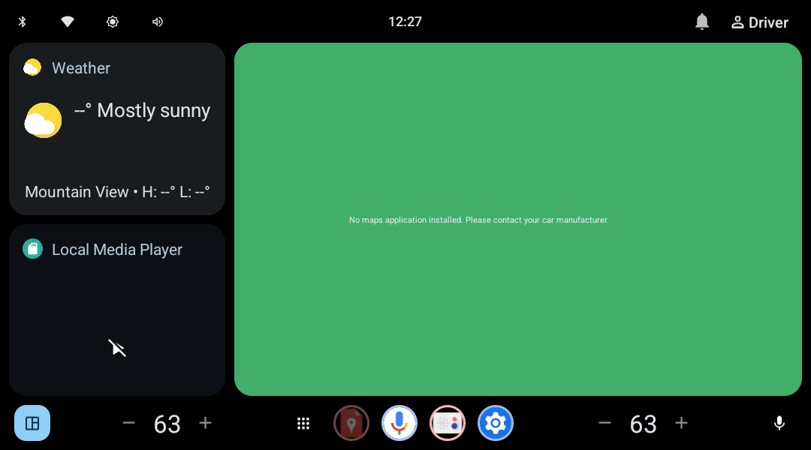
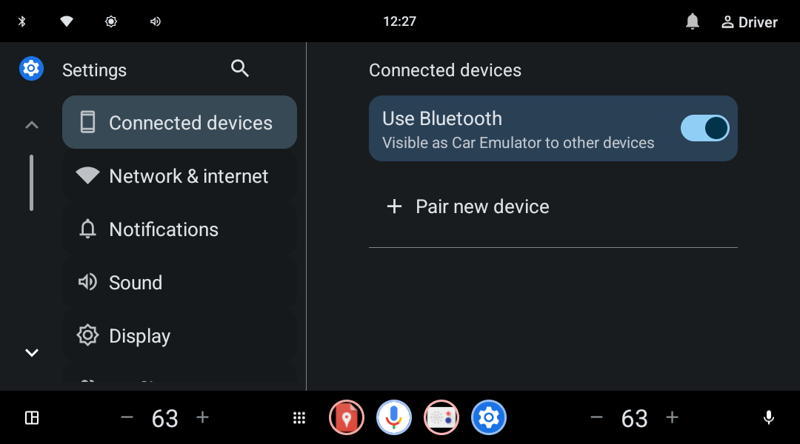
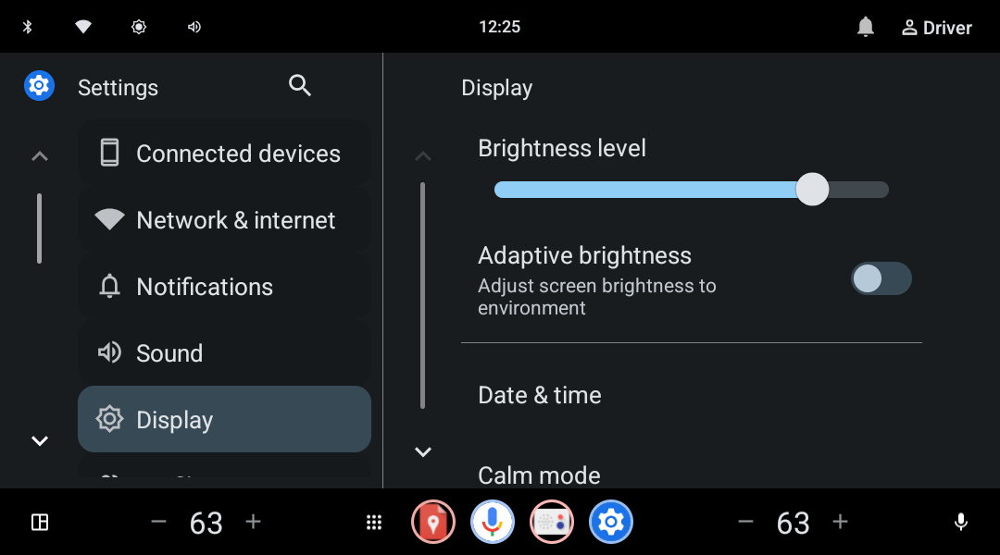
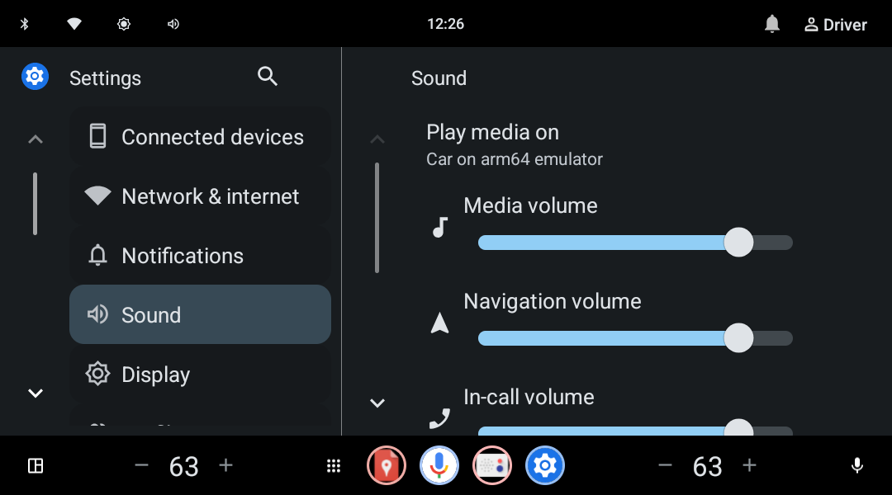

# IVI Visual Agent

A fully local, goal-driven visual agent for Android Automotive and Android IVI testing.
Give it an outcome such as `Open the Bluetooth settings screen`; it observes the current
screen, chooses one grounded action, executes it through ADB, and independently verifies
the result.

The agent does not contain a recorded menu route for the emulator, a Samsung phone, or
the target IVI. It uses Android accessibility data when available and a numbered visual
grid when a custom IVI surface exposes only pixels.

> This is an early bench-testing MVP. Do not operate it in a moving vehicle or connect it
> to a production vehicle without an appropriate safety review.

## Tested emulator screens

These are direct screenshots from the Android 15 Automotive ARM64 emulator used during
development.

### Automotive Home



### Bluetooth settings — passed

```bash
ivi-agent --config config.json run --serial emulator-5554 \
  --goal "Open the Bluetooth settings screen"
```



### Display settings — passed

```bash
ivi-agent --config config.json run --serial emulator-5554 \
  --goal "Open the Display settings screen"
```



### Sound settings — passed

```bash
ivi-agent --config config.json run --serial emulator-5554 \
  --goal "Open the Sound settings screen"
```



The three runs above passed with the local `qwen3.5:4b` vision model. The final screen
was verified from visible titles and page controls, not from the action planner's claim.

## Complete macOS setup

The commands below are the Apple Silicon setup used for the screenshots above.

### 1. Install the local tools

```bash
brew install android-commandlinetools openjdk scrcpy tesseract ollama

export ANDROID_HOME="/opt/homebrew/share/android-commandlinetools"
export PATH="/opt/homebrew/opt/openjdk/bin:$ANDROID_HOME/cmdline-tools/latest/bin:$ANDROID_HOME/platform-tools:$ANDROID_HOME/emulator:$PATH"
```

To make those paths permanent, add the two `export` lines to `~/.zshrc`, then open a new
terminal or run `source ~/.zshrc`.

### 2. Install and create the Automotive emulator

```bash
yes | sdkmanager --licenses

sdkmanager \
  "platform-tools" \
  "emulator" \
  "system-images;android-35-ext15;android-automotive;arm64-v8a"

echo no | avdmanager create avd \
  --name ivi_agent_api35 \
  --package "system-images;android-35-ext15;android-automotive;arm64-v8a" \
  --device automotive_1080p_landscape \
  --force
```

Confirm that the AVD exists:

```bash
emulator -list-avds
```

Expected output includes:

```text
ivi_agent_api35
```

### 3. Start the emulator

For a visible simulator window:

```bash
emulator @ivi_agent_api35 -no-audio -no-boot-anim \
  -gpu swiftshader_indirect
```

For a headless CI-style run:

```bash
emulator @ivi_agent_api35 -no-window -no-audio -no-boot-anim \
  -no-snapshot -gpu swiftshader_indirect
```

In another terminal, wait for Android and confirm the serial:

```bash
adb -s emulator-5554 wait-for-device

until [ "$(adb -s emulator-5554 shell getprop sys.boot_completed | tr -d '\r')" = "1" ]; do
  sleep 2
done

adb devices
```

Expected output:

```text
List of devices attached
emulator-5554 device
```

If the serial is different, use the serial printed by `adb devices` in subsequent
commands.

### 4. Start Ollama and download the local vision model

Run this in a separate terminal and leave it running:

```bash
ollama serve
```

Then download the model once:

```bash
ollama pull qwen3.5:4b
ollama list
```

### 5. Clone and install the agent

```bash
git clone https://github.com/vanarasai/ivi-visual-agent.git
cd ivi-visual-agent

python3 -m venv .venv
source .venv/bin/activate
python -m pip install --upgrade pip
python -m pip install -e .

cp config.example.json config.json
ivi-agent --config config.json doctor
python -m unittest discover -s tests -v
```

### 6. Mirror or record the emulator

Open a live scrcpy window:

```bash
ivi-agent scrcpy --serial emulator-5554
```

Or record the complete trial:

```bash
ivi-agent scrcpy --serial emulator-5554 --record session.mp4
```

### 7. Perform a safe dry run

A dry run captures the real screen and proposes only the first action:

```bash
ivi-agent --config config.json run \
  --serial emulator-5554 \
  --goal "Open the Bluetooth settings screen" \
  --dry-run
```

Check the proposed target, confidence, screenshot, and report under `runs/`.

### 8. Run the closed-loop test

```bash
ivi-agent --config config.json run \
  --serial emulator-5554 \
  --goal "Open the Bluetooth settings screen"
```

Always supply `--serial` when a phone and emulator may both be connected. This prevents
the test from selecting the wrong Android device.

## Running against a physical Android IVI

Enable Developer options and USB debugging on the bench IVI, authorize the host, and
check the connection:

```bash
adb devices
adb -s IVI_SERIAL shell wm size
```

Preview the IVI:

```bash
ivi-agent scrcpy --serial IVI_SERIAL
```

Run the same dry-run/full-run sequence used for the emulator:

```bash
ivi-agent --config config.json run --serial IVI_SERIAL \
  --goal "Open the Bluetooth settings screen" --dry-run

ivi-agent --config config.json run --serial IVI_SERIAL \
  --goal "Open the Bluetooth settings screen"
```

Automotive builds can expose several displays. The capture layer automatically selects
the primary physical display. To test a different display, first determine its ID and
then pass it explicitly:

```bash
adb -s IVI_SERIAL shell dumpsys SurfaceFlinger --display-id

ivi-agent --config config.json run --serial IVI_SERIAL \
  --display-id DISPLAY_ID \
  --goal "Open the Bluetooth settings screen"
```

## How the goal-driven loop works

1. Convert the user goal into an optional entry-screen milestone and the exact requested
   result; discard speculative intermediate routes.
2. Capture the selected physical display and Android UI hierarchy.
3. Give the local model both the screenshot and grounded UI candidates.
4. Use accessibility bounds when possible; otherwise locate the named visual target on
   a generic 12-by-6 grid.
5. Execute one atomic ADB action and wait for the screen to settle.
6. Remember actions that made no visible progress on that visual state.
7. Independently verify visible evidence before reporting success.

This adapts the planner/context/controller/executor separation used by
[minitap-ai/mobile-use](https://github.com/minitap-ai/mobile-use) while keeping the
runtime local and lightweight. It intentionally does not copy a fixed navigation route
from the reference project.

## Configuration

The default `config.example.json` uses:

```json
{
  "ollama_url": "http://127.0.0.1:11434",
  "model": "qwen3.5:4b",
  "max_actions": 12,
  "timeout_seconds": 120,
  "model_timeout_seconds": 30,
  "minimum_action_confidence": 0.75,
  "minimum_success_confidence": 0.85,
  "settle_timeout_seconds": 5.0,
  "prefer_ui_tree": true,
  "enable_ocr": true,
  "max_image_dimension": 768,
  "allow_text_input": true,
  "protected_regions": []
}
```

Coordinates in `protected_regions` are normalized rectangles in the form
`[left, top, right, bottom]`. This prevents taps in the upper-right corner:

```json
{
  "protected_regions": [[0.8, 0.0, 1.0, 0.2]]
}
```

Set `allow_text_input` to `false` for trials that must never type. The controller also
rejects low-confidence actions, malformed coordinates, semantically unrelated targets,
state-changing taps for navigation goals, repeated no-progress actions, unrequested
permission changes, and destructive or external actions proposed by the model.

## Run evidence

Each run creates a timestamped directory under `runs/` containing:

- `step-NN.png`: screen observed before each decision
- `step-NN-after.png`: screen after an executed action
- `result.json`: goal, subgoals, actions, timing, and verification evidence
- `report.html`: a human-readable test report

The `runs/` directory is intentionally ignored by Git because it can grow quickly.

## Current limitations

- Icon-only custom controls still depend on the local vision model's recognition.
- A small local model can choose a poor strategy; grounding and loop detection stop the
  run safely but cannot make every goal solvable.
- Bluetooth pairing requires a discoverable test device and may require a second
  automation channel or human confirmation for the PIN.
- Visual verification proves the displayed UI state, not the underlying Android service
  state. Production tests should also query the relevant system/service signal.
- iOS Simulator is not a substitute for this test environment: this project executes
  through Android ADB and targets Android Automotive/IVI surfaces.
